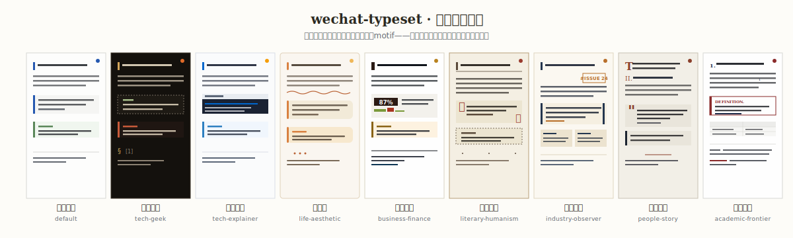
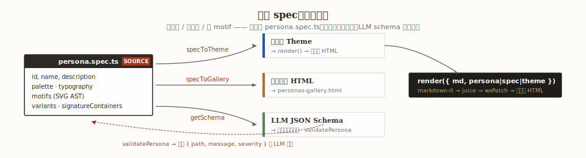

# wechat-typeset

> 一个浏览器里的 Markdown 排字工作台：左边写，右边是一个 375 px 的手机，点一下「一键复制」，整篇文章作为富文本躺进微信公众号编辑器——不登账号、不跑后端、不出一个字节。

[](package.json)
[](LICENSE)
[](package.json)

<p align="center">
  
</p>

**即插即用的 LLM 技能**——仓库内 [`skills/wechat-typeset/`](skills/wechat-typeset/) 是一份可直接挂载到 Claude / 其它 Agent 的 skill 包：命中"公众号""微信排版"等信号自动启用，喂 LLM 一份 `PersonaSpec` JSON Schema 让它**生成主题**，再由 `validatePersona` 把违反微信约束的输出挡回去修订。

---

## 为什么存在这个工具

公众号编辑器是 2013 年的排版直觉遇上 2026 年的长文写作——`<class>` 全部剥离、`font-family` 被客户端覆盖、1 px 以下描边会在服务端栅格化时消失。主流的"Markdown 转公众号"工具把这当成 CSS bug 绕过去，产物是**同一种 Medium 蓝**套在所有题材上：财经内参和生活随笔共享一组 H2 边框，人物特稿和技术布道用同一根分割线。

LLM 已经能把任何想法润色成段落，真正稀缺的不是文字，是**让文字拥有视觉身份**——财经稿读起来像研究所内参，人物特稿读起来像《人物》杂志，工程随笔读起来像 manpage 而不是 VSCode 皮肤。wechat-typeset 把这件事做成一等公民：9 套**主题人格**（Theme Persona）各自持有独立的调色板、字距律动、SVG motif 和容器变体纪律，切换主题不只是换色，是换一种读者关系。

## 在线演示

👉 **[在线编辑器](https://lync-cyber.github.io/wechat-typeset)** —— 无需安装，浏览器里即刻体验

---

## 快速开始

```bash
git clone https://github.com/lync-cyber/wechat-typeset.git
cd wechat-typeset

npm ci            # 严格按 lockfile 安装，避免主题构建器触发 ThemeAuthoringError
npm run dev       # http://127.0.0.1:5173，secure context 下剪贴板才能写 HTML
```

浏览器打开后即是完整编辑器。`npm run build` 会先跑 `vue-tsc --noEmit` 再产出 `dist/`；`npm test` 把 vitest 单测与 `sample-full.md` 端到端校验一起过一遍。

## 主题人格系统（Theme Personas）

每套人格是一份 JSON-serializable 的 `PersonaSpec`——色板、字号、motif AST、容器变体全部在里面。`specToTheme(spec)` 把它投影成运行时 `Theme`，`validatePersona` 用同一份 schema 把微信平台约束（禁 `font-family` / 禁 1 px 以下描边 / 禁 `<14px` 字号）在构造期挡下来。

<p align="center">
  
</p>


| 人格 | slug | 气质定语 | 适用场景 |
| --- | --- | --- | --- |
| **默认主题** | `default` | 有意识的中立——Medium / Notion / Substack 家族 | 全题材公平阅读，不抢戏 |
| **极客夜行** | `tech-geek` | VT220 琥珀 + 墨炭暖底 + manpage 脚注纪律 | 工程随笔 / 架构评论 / RFC 风布道 |
| **文档白昼** | `tech-explainer` | Stripe Docs / MDN / Tailwind Docs 清凉白 | 产品文档 / 教程 / 手把手跟做 |
| **慢生活** | `life-aesthetic` | 暖米底 + 圆角柔和 + 花瓣叶片装饰 | 饮食 / 旅行 / 长日的非虚构 |
| **硬核财经** | `business-finance` | 深栗墨 + 内参蓝 + 直角版面 | FT 中文 / 财新周刊 / Bloomberg 家族 |
| **人文札记** | `literary-humanism` | 宋椠古籍 + 藏经朱 + 方版心 0 圆角 | 散文 / 书评 / 长评 |
| **行业观察** | `industry-observer` | Stratechery 米底 + Issue 印章 | 行业周刊 / analyst essay |
| **人物特稿** | `people-story` | 冷米 + 深墨靛 + 巨号 serif 引号 | 《人物》/ GQ / New Yorker Profiles |
| **学术前沿** | `academic-frontier` | Nature / arXiv 家族，极少装饰是纪律 | 同行评审级陈述 / 论文化稿 |

**切换主题**：顶栏左侧的主题选择器即时切换，预览与"一键复制"产物完全同步。

**自定义主题**：主题的 ground truth 是各自目录下的 `persona.spec.ts`——改色板、改字距、改容器变体都在那里。运行时其余文件只是从 spec 投影出来的视图。完整流程见 [docs/theme-authoring.md](docs/theme-authoring.md)。

## 容器扩展语法

微信公众号里出现频率最高的几个视觉元素（提示块、金句、对比、步骤），原本需要作者手写嵌套 `<section>`。本项目把它们封装成 `markdown-it-container` 语法，`key=value` 在 open 行声明，嵌套靠冒号长度决定。

**提示块**——`tip` / `warning` / `info` / `danger` 四态靠**形状冗余**区分，而非仅靠色差（色盲友好）：

```markdown
::: tip 小贴士
草稿 100% 落在 localStorage，刷新页面不丢。
:::
```

> 渲染：左侧 3 px 主题色竖条 + 标签 `TIP` + `bgSoft` 填色容器。`tech-geek` 下标签变成 `NOTE` 虚线框，`business-finance` 下变成 pill tag。

**金句卡**——大字号居中，带装饰引号 SVG：

```markdown
::: quote-card
预览 = 剪贴板。任何"预览好看、粘贴后塌"的分支都是 bug。
—— wx-md 硬约束
:::
```

**对比块**——外 4 内 3 的嵌套冒号，`compare` 承载两列 `pros` / `cons`：

```markdown
:::: compare
::: pros 预览一致
- 不跑后端 · 草稿在本地
- 375 px iframe 锁死
:::
::: cons 平台约束
- 禁 class / font-family
- 禁 1 px 以下描边
:::
::::
```

**步骤卡**——有序列表套在 `steps` 里，数字徽章走主题 `stepBadge(n)` SVG：

```markdown
::: steps
1. 粘贴 Markdown 原文
2. 切主题、看 375 px 预览
3. 点「一键复制」→ 回公众号粘贴
:::
```

完整的 20+ 容器清单（`intro` / `author` / `cover` / `highlight` / `section-title` / `divider` / `footer-cta` / `recommend` / `qrcode` / `mpvoice` / `mpvideo`……）见 [docs/container-syntax.md](docs/container-syntax.md)。

## 项目结构

```
src/
├── App.vue                   # 三栏外壳：抽屉 / 编辑器 / 预览
├── components/               # Vue 3 SFC（Toolbar / Editor / Preview / ThemePicker）
├── pipeline/                 # Markdown → HTML 渲染管线
│   ├── markdown.ts           #   markdown-it 主入口 + 容器注册
│   ├── themeCSS.ts           #   Theme → CSS 字符串（font-family 守卫在此 throw）
│   ├── juiceInline.ts        #   juice 内联化：class 全消，style 全入 style=""
│   ├── wxPatch/              #   平台补丁：剥 position、剥 @media、iframe 白名单
│   └── rules.ts              #   所有微信硬约束的单一真相来源
├── themes/                   # 9 套主题人格，每套一个目录
│   └── tech-geek/persona.spec.ts  # ← 改外观就改这里，index.ts 只做投影
├── variants/                 # 容器变体（accent-bar / pill-tag / ticket-notch …）
├── color/                    # 配色生成器 + 10 套预设 palette
├── clipboard/copyHtml.ts     # navigator.clipboard.write(ClipboardItem) 富文本复制
├── storage/                  # localStorage 草稿层，本地 only
└── samples/                  # sample-full.md 端到端验收样本
```

## 作为 LLM 技能（Agent Skill）

`skills/wechat-typeset/` 是一份独立的 Claude Code / Agent SDK skill 包。接入后，Agent 在遇到"把这篇 Markdown 发公众号""给财经稿挑套主题""为这个话题造一套人设"之类诉求时会自动装载，拿到：

- **9 套内置人格**的摘要 + 完整 `PersonaSpec`（`listPersonas()` / `getPersona(id)`）
- **`PersonaSpec` 的 JSON Schema**（`getSchema()`），直接塞进结构化输出约束
- **`validatePersona(spec)`**——返回 `{ path, message, severity }` 列表，LLM 按反馈改写一轮就能拿到一份稳定粘贴的 spec

参考文档在 `skills/wechat-typeset/references/`：`api.md` / `hard-rules.md` / `motif-ast.md` / `personas.md`——都是压缩给 LLM 吃的密度写法。想自己集成而非挂 skill，直接从 `src/public` 导入同一套符号即可，见 [docs/theme-authoring.md](docs/theme-authoring.md#公共-api给外部集成方)。

## 贡献与扩展

**新增一套主题人格**（三步概述）：

1. `cp -r src/themes/default src/themes/your-slug`，改 `persona.spec.ts` 里的 `id` / `name` / `palette` / `motifs`。
2. `npm run validate:spec` —— schema 校验 + 平台约束守卫会把 `font-family` / 1 px 以下描边 / `<14px` 字号全部拦下。
3. `npm run dev` 热更新预览，`npm test` 跑端到端，主题目录被 `import.meta.glob` 自动发现，无需改注册表。

**提 issue / PR** 前请阅读 [CONTRIBUTING.md](CONTRIBUTING.md) 的自检清单——尤其是"不引入任何新网络请求"和"预览 = 剪贴板"两条硬纪律。

## License

MIT · © 2026 lync-cyber
