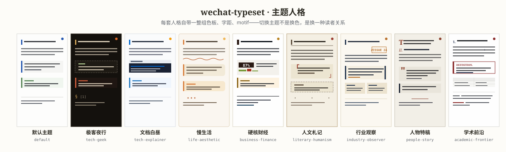

# wechat-typeset

> 写 Markdown，看手机预览，一键复制进公众号——不登账号，不跑后端，草稿存在本地不丢。

[](LICENSE)
[](package.json)

<p align="center">
  
</p>

**[在线编辑器](https://lync-cyber.github.io/wechat-typeset)** — 无需安装，浏览器打开即用。

> [写作契约](docs/contract/README.md)：基础契约（`base`）+ 领域扩展包（`pack:*`，如 `pack:editorial`）+ 主题专属扩展（`theme:*`）三层覆盖全部作者 API，可在 markdown 头部用 frontmatter 声明页面级主题与变体。主题间切换不塌版，复制到公众号不丢样。

---

## 用法

左侧写 Markdown，右侧是锁死在 375 px 的手机预览，实时同步。确认排版后点「一键复制」，回到公众号编辑器粘贴——样式以富文本写入，微信端所见即预览所见。草稿自动落在 `localStorage`，刷新或关掉标签页不丢。

需要把草稿发给另一个人协作？Toolbar 菜单的「复制分享链接」把正文与主题打包进 URL hash（base64url 编码，无后端存储），收方打开即以只读草稿载入。

---

## 主题

切换主题不只是换色，是换一套配色、字距、装饰语言，以及随之而来的一种读者关系。顶栏左侧选择器即时切换，复制产物与预览完全同步。

| 主题 | 气质 | 适合写 |
|---|---|---|
| **默认** | 简洁中立 | 通用题材，不抢内容风头 |
| **极客夜行** | 终端琥珀·暗底 | 技术文章、架构随笔、工程日志 |
| **文档白昼** | 清爽白底·等宽 | 教程、产品说明、手把手跟做 |
| **慢生活** | 暖米·圆角·叶片装饰 | 饮食、旅行、生活记录 |
| **硬核财经** | 深栗墨·内参蓝·直角 | 行业分析、财经报道 |
| **数据简报** | 数据蓝·黑底代码·直角 | 数据 newsletter、季度复盘；KPI 仪表盘/条形图等主题专属容器仅此主题下生效 |
| **人文札记** | 古籍朱红·方版心 | 散文、书评、长评 |
| **行业观察** | 米底·Issue 印章 | 行业周刊、观点文章 |
| **人物特稿** | 冷米·深墨靛·巨号引号 | 人物故事、深度报道 |
| **学术前沿** | 极简白·极少装饰 | 论文风格、同行评审级陈述 |
| **粗野主义报刊** | 近黑底·荧光黄·直角硬边 | punk-zine、夜读简报、文化批评、实验栏目 |

---

## 排版块

标准 Markdown 之外，wechat-typeset 提供公众号高频版式。以往需要手写嵌套 HTML；现在在 Markdown 里三行声明，主题自动决定渲染样式。

**提示块** — 四种状态：`tip` / `warning` / `info` / `danger`，用形状而非仅靠颜色区分（色盲友好）。

```markdown
::: tip 小贴士
草稿自动保存在浏览器本地，关掉标签页再开还在。
:::
```

**金句卡** — 大字居中，带主题装饰引号。

```markdown
::: quote-card
预览好看、粘贴后塌——这种情况在 wechat-typeset 里是 bug，不是特性。
:::
```

**步骤卡** — 有序列表，数字徽章跟随主题风格渲染。

```markdown
::: steps
1. 粘贴 Markdown 原文
2. 切主题、看手机预览
3. 点「一键复制」，回公众号粘贴
:::
```

**对比块** — 两列并排，外层四冒号，内层三冒号。

```markdown
:::: compare
::: pros 优点
- 无需登录，草稿在本地
- 375 px 预览锁死不变形
:::
::: cons 限制
- 仅适配微信公众号
- 需要浏览器剪贴板权限
:::
::::
```

完整清单（作者卡、封面、分割线、推荐卡、二维码……）见 [docs/contract/base.md](docs/contract/base.md)；刊物/newsletter 家族（刊头、目录、Q&A、脚注、CTA……）见 [docs/contract/packs/editorial.md](docs/contract/packs/editorial.md)；数据简报 KPI/条形图（仅 `data-brief` 主题）见 [docs/contract/packs/data-brief.md](docs/contract/packs/data-brief.md)。页面级主题或变体切换可用 frontmatter 声明，API 层可通过 `getThemeCapabilities(personaId)` 查询主题可用容器与推荐变体。

---

## 为什么不用现有工具

公众号编辑器对样式有严格限制：`class` 属性全部剥离，`font-family` 被客户端覆盖，细于 1 px 的描边会在服务端栅格化时消失。大多数"Markdown 转公众号"工具把这当成技术 bug 绕过去，结果是一套蓝色主题套在所有题材上——财经稿与生活随笔共用同一组标题样式。

wechat-typeset 把视觉气质当成一等公民处理。每套主题持有完整的配色律、字距律、SVG motif 和容器变体，微信平台约束在渲染管线内处理，不由作者承担。

---

## 本地运行

```bash
git clone https://github.com/lync-cyber/wechat-typeset.git
cd wechat-typeset
npm ci
npm run dev
```

浏览器打开 `http://127.0.0.1:5173` 即是完整编辑器。`npm run build` 产出静态文件，`npm test` 跑单测与端到端校验。

---

## 镜像部署

四个入口同构于 main 分支，差别只在部署目标：

- **GitHub Pages** — `.github/workflows/deploy-pages.yml`，`VITE_BASE=/wechat-typeset/`
- **jsDelivr CDN** — `.github/workflows/deploy-jsdelivr.yml` 把产物推到 `jsdelivr-cdn` 分支；jsDelivr 自动从该 ref 分发，`VITE_BASE` 为绝对 URL；floating branch 缓存 12 h，workflow 末端 purge `index.html` 触发立即刷新
- **Cloudflare Pages / Netlify** — 在各自控制台一键连接仓库即可：CF 选 framework preset `Vite`（无需额外配置）；Netlify 自动读取仓库根的 `netlify.toml`

想自建镜像？把 `dist/` 上传任意静态主机。`VITE_BASE` 默认 `/`，部署到子路径时设为 `/subpath/`，部署到异域 CDN 时设为完整绝对 URL。

---

## 参与贡献

提 issue / PR 前请阅读 [CONTRIBUTING.md](CONTRIBUTING.md)。新增主题流程见 [docs/theme-authoring.md](docs/theme-authoring.md)。

---

## 技术集成

`skills/wechat-typeset/` 是一份可挂载到 Claude / 其它 Agent 的 skill 包，支持结构化生成主题、校验微信平台约束。参考文档在 [skills/wechat-typeset/references/](skills/wechat-typeset/references/)。

### 公开契约：capabilities.json

外部工具链（LLM agent / MCP server / 自建 CI）通过订阅 `capabilities.json` 获悉当前支持的主题、容器、变体、平台与硬约束。本契约保持向后兼容（minor 仅增字段；移除项先经一个 minor 窗口的 `deprecations[]` 登记，详见 [scripts/capabilities-diff.ts](scripts/capabilities-diff.ts)）。

订阅 URL（jsDelivr CDN，免鉴权、CORS 友好）：

- **追主分支** — `https://cdn.jsdelivr.net/gh/lync-cyber/wechat-typeset@main/dist/api/capabilities.json`
  jsDelivr 主分支缓存 12 h，发布后自然刷新；适合开发期工具链
- **钉版本** — `https://cdn.jsdelivr.net/gh/lync-cyber/wechat-typeset@v{x.y.z}/dist/api/capabilities.json`
  钉到 git tag，永远不变；适合生产消费方

字段 `selfUri` / `versionedSelfUri` 同样写在 JSON 内部，下游拿到内容时即可知自己来自哪里。`fallbackBehavior` 字段是降级合同的机器可读副本，详见 [docs/contract/fallback.md](docs/contract/fallback.md)。`compatibility.minToolVersion` / `errorCodes` / `cli.commands` 三段位让 LLM 工具集成可以从一份 JSON 完成版本桥接、错误分支与 function-calling 注册。

项目技术栈：Vue 3 · TypeScript · Vite · markdown-it · CodeMirror 6（含 autocomplete / lint）· turndown · juice。

---

MIT · © 2026 lync-cyber
